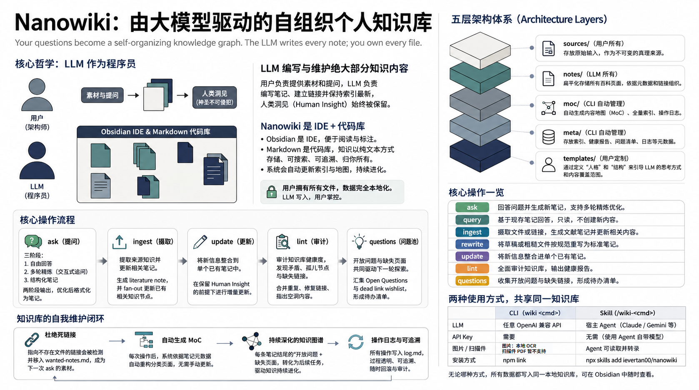

<p align="center">
  
</p>

<h1 align="center">Nanowiki</h1>

<p align="center">
  <b>Your questions become a self-organizing knowledge graph.<br>The LLM writes every note; you own every file.</b>
</p>

<p align="center">
  <a href="https://opensource.org/licenses/MIT"></a>
  <a href="https://nodejs.org">= 18"></a>
</p>

---



## Philosophy

Inspired by [Andrej Karpathy's vision for an "llm-wiki"](https://gist.github.com/karpathy/442a6bf555914893e9891c11519de94f):

> You never (or rarely) write the wiki yourself — **the LLM writes and maintains all of it.** You are in charge of sourcing, exploration, and asking the right questions.

Nanowiki is for people whose real thinking already happens with LLMs, but whose best conversations still disappear into disposable chat history. It is not another notes app. It is a local knowledge compiler: you choose the questions and sources; the LLM maintains the graph.

The promise is not that the model is always right. The promise is that useful AI cognition becomes durable, inspectable, revisable knowledge: Markdown notes, typed links, source-aware facts, Maps of Content, indexes, logs, and open-question queues in a vault you own.

- **The human owns judgment.** You decide what is worth asking, which sources matter, what deserves promotion, and when a synthesis is weak.
- **The LLM owns maintenance.** It drafts, links, formats, classifies, and keeps the graph moving.
- **Code owns invariants.** Dates, schema validity, source preservation, dead-link removal, collision guards, and the Human Insight section are protected outside the model.
- **Obsidian is the IDE.** You read, navigate, annotate, and inspect the vault there, but the real artifact is plain Markdown files.

Nanowiki rejects filing as the center of knowledge work. Folders, perfect tags, and manual index upkeep should not be the main job. The graph should grow through deliberate promotion - not automatic transcript hoarding - and remain readable, greppable, versionable, and portable.

See [docs/philosophy.md](docs/philosophy.md) for the full positioning and design principles.

---

## Quick Start

**Option A — CLI** (any LLM API key, any platform):

```powershell
git clone https://github.com/ievertan00/nanowiki.git
cd nanowiki
npm install
npm link                  # exposes `wiki` globally

copy .env.example .env    # set WIKI_PATH + GEMINI_API_KEY (or DeepSeek/Qwen/Ollama)
wiki init                 # bootstrap the vault
wiki ask "What is the attention mechanism?"
```

**Option B — Agent skill** (no API key — the agent is the LLM):

```
npx skills add ievertan00/nanowiki
```

Then in Claude Code or Gemini CLI:

```
/wiki-ask "What is the attention mechanism?"
```

That's it. Point Obsidian at `WIKI_PATH` and your knowledge graph is already there.

---

## Two Front Ends, One Vault

| | CLI (`wiki <cmd>`) | Skill (`/wiki-<cmd>`) |
|---|---|---|
| **LLM** | Any OpenAI-compatible API | The host agent (Claude, Gemini, …) |
| **API key** | Required | None — uses the agent's own model |
| **Image** | OCR'd via `tesseract.js` | Agent reads and transcribes visually |
| **Scanned PDF** | Not supported | Agent reads and transcribes visually |
| **Install** | `npm link` | `npx skills add ievertan00/nanowiki` |

Both front ends write to the same vault. You can mix and match freely.

---

## Core Operations

| Operation | What it does |
| --- | --- |
| `ask "<question>"` | Answer a question, then format the answer into a new linked note. Interactive refine loop before saving. |
| `query "<question>"` | Answer from your existing notes only, with `[[note]]` citations. Read-only. |
| `ingest <file\|url>` | Write a literature note for a source, then fan out targeted additions to related notes. |
| `deep-ingest <file\|url>` | Ingest a source, generate reviewable grounded follow-up questions, save synthesis notes, then lint. |
| `rewrite <file>` | Reformat a draft or rough file into the note schema (Human Insight preserved). |
| `update <note> "<info>"` | Integrate new information into one existing note in place. |
| `lint` | Health-check the vault: consolidate domains, surface contradictions, orphans, thin notes. |
| `questions` | Harvest every `## Open Questions` + dead-link wishlist into a worklist for your next `ask`. |

Six of these are also available as agent slash commands (`/wiki-ask`, `/wiki-query`, `/wiki-ingest`, `/wiki-deep-ingest`, `/wiki-rewrite`, `/wiki-lint`).

---

## What You Never Have to Do

You never name files, create folders, update an index, or draw links manually. After every mutating command, the CLI regenerates:

- `moc/<domain>.md` — notes grouped by topic, derived from frontmatter
- `meta/index.md` — full note catalog
- `meta/log.md` — append-only operation log

The taxonomy (domains and topics) grows as the LLM coins new ones, written back to `wiki-config.json`. Dead links are stripped before saving and queued in `meta/wanted-notes.md` — a wishlist `wiki questions` folds into your next session.

---

## Architecture

The vault is built from five layers, each with a clear owner:

| Layer | Owner | What it holds |
| --- | --- | --- |
| `sources/` | **You** | Raw inputs — articles, papers, transcripts, drafts. Immutable. |
| `notes/` | **The LLM** | All wiki pages, flat. Organization is frontmatter + `[[links]]`, never folders. |
| `moc/` | **The CLI** | Per-domain Maps of Content, auto-regenerated after every change. |
| `meta/` | **The CLI** | The full note index, lint reports, dead-link/question worklists, and an append-only operation log. |
| `templates/` | **You** | Persona/focus-area text blocks for `ask`/`ingest` (`-p`/`--persona`, `-s`/`--structure`), seeded with defaults on `init`. |

### Vault Structure

```
wiki-vault/
├── sources/          ← your raw inputs (immutable)
├── notes/            ← all LLM-generated notes (flat)
├── moc/              ← per-domain Maps of Content (auto-generated)
│   ├── ai.md
│   └── engineering.md
├── meta/
│   ├── index.md          ← full note catalog (auto-generated)
│   ├── lint-<date>.md    ← health-check reports (wiki lint)
│   ├── questions.md      ← worklist: Open Questions + wanted-notes (wiki questions)
│   ├── wanted-notes.md   ← dead-link wishlist — notes referenced but not yet created
│   ├── ingested.json     ← content-hash ledger so `ingest` is idempotent
│   └── log.md            ← append-only, grep-friendly operation log
├── templates/
│   ├── personas/     ← reusable voice/framing text blocks (-p/--persona <name>), seeded with defaults
│   └── structures/   ← reusable focus-area checklists (-s/--structure <name>), seeded with defaults
├── wiki-config.json  ← live taxonomy (domains/topics) + overrides
└── WIKI.md           ← the schema document, co-evolved by you and the LLM
```

On first run the vault is scaffolded automatically — directories, a default `wiki-config.json`, and `WIKI.md`. Existing files are never overwritten. Point Obsidian at the vault and everything — `[[links]]`, YAML frontmatter, tags — works out of the box.

### Note Structure

Every note shares one schema: YAML frontmatter for organization, fixed sections for content.

```markdown
---
title: 注意力机制原理与跨领域应用
type: atomic # or literature (for source summaries)
source: # filename/title of the source, for literature notes
domain: ai
topic: attention
tags: [attention, transformer, cross-domain]
created: 2026-06-12
updated: 2026-06-12
---

## Source Facts ← only what sources directly state, as bullets

## Synthesis ← cross-source interpretation (clearly LLM inference)

## Connections ← typed links to existing notes only

## Speculation ← unverified but interesting inferences

## Open Questions ← what this note does not resolve

## Human Insight ← yours alone — the LLM never touches it
```

Two invariants are enforced **in code**, independent of the LLM:

- **Human Insight is sacred.** It is extracted before any rewrite/update and restored verbatim afterward.
- **No dead links.** Connections use typed links (`extends::`, `contradicts::`, `requires::`, `examples::`, `related::`), and any link whose target isn't a real file is stripped.

## Workflows

### The multi-round `ask` loop

`ask` is two LLM passes wrapped around an interactive refine loop:

- **Pass 1 (answer)** — a near-empty system prompt asks the model to simply answer the question well: free-form, no schema in the way.
- **Pass 2 (format)** — one final call reshapes the answer into the note schema, assigns domain/topic against the existing taxonomy, and links only to notes that already exist.

Between the two passes you stay in the loop as long as you like. Each follow-up revises the free-form answer in place, and nothing is saved until you finish — so the expensive format pass runs exactly once:

```
wiki ask "<question>"
  → pass 1 (answer)
  → render answer to terminal
  → "Any further question? [Y/n]"        (Enter or y/Y = continue; n/N = finish)
      Y → suggestQuestions() lists 2–3 related follow-ups to pursue next
        → prompt for follow-up (type your own, or a number to pick a suggestion)
        → refineAnswer() returns the complete updated answer → render → loop
      N → save ONCE:
          final refined answer to sources/<slug>.md — the note's source of record,
          pass 2 (format, with pass-1 candidates) → Source Facts bullets stamped
            ^[<slug>] in code, pointing at that source → note via saveNote
            (collision guard, cleaning, dead-link capture),
          taxonomy, log, MOC/index/WIKI regen
```

The saved pass-1 answer is not just a backup: it is the **source** of the pass-2 note. Every `## Source Facts` bullet is stamped with a `^[<slug>]` citation marker (in code, never by the model) that resolves to that file in `sources/`, the same way `ingest` ties facts to the documents it reads — so `wiki lint`'s citation check covers ask notes too.

The loop then continues across days: each saved note ends with `Open Questions`, which become your next `ask` — a **conversation with your own wiki** where every round deepens and links the graph. You never organize anything; domains, topics, links, MOCs, and the index all maintain themselves.

### Feeding it sources

```powershell
wiki ingest attention-paper.md                 # bare name resolves under <vault>/sources/
wiki ingest attention-paper.pdf                # PDF text is extracted automatically
wiki ingest whiteboard-photo.png               # image text is OCR'd via tesseract.js
wiki ingest https://example.com/great-post    # URLs are fetched into sources/ first
```

A single source may update many notes: the LLM extracts a summary plus targeted additions, writes a `literature` note, and integrates each addition into the existing note it belongs to. Updates that target a note which doesn't exist are skipped — never invented.

**Supported source formats:**

| Source | CLI (`wiki ingest`) | Skill (`/wiki-ingest`) |
| --- | --- | --- |
| Markdown/text | read directly | read directly |
| PDF | text extracted via `pdf-parse` (text-based PDFs only) | read via the agent's Read tool (chunked by page range if >20 pages) |
| Image | OCR'd via `tesseract.js` (pure-WASM, `eng+chi_sim`) | read visually and transcribed by the agent |
| Web/YouTube URL | fetched to `sources/` via Jina Reader, then ingested | fetched and reduced to Markdown by the agent's own fetch tool |

The CLI OCRs standalone image files locally — `tesseract.js` is pure-WASM (no system binary), recognizes English + Simplified Chinese, and downloads its traineddata on first use, caching it thereafter. Scanned/image-only PDFs still need the skill front end (which reads them visually via the agent), since the CLI would have to rasterize PDF pages first.

### Why one literature note per source?

`ingest` deliberately produces exactly **one** literature note per source — never a batch of new atomic notes. That note is the source's permanent anchor in the vault: every fact extracted from the document lives under its `## Source Facts`, and every existing atomic note that the source touches gets a targeted addition via fan-out. The fan-out is content-preserving by construction: if the LLM's rewrite of a touched note drops any of its pre-existing `## Source Facts`, the code (`updateNote`/`lostSourceFacts`) discards the rewrite and appends the addition as a plain new bullet instead — so a fan-out can only ever deepen a note, never lose what was already there. New concepts that don't yet have a home aren't invented as notes on the spot; dead links the LLM tried to draw are stripped and queued in `meta/wanted-notes.md`, which `wiki questions` folds into your worklist for a future `wiki ask` — a human decision, not an automatic one.

The alternative — minting a new atomic note for every distinct concept a source mentions — was considered and rejected. Creating a *good* atomic note requires the same care `ask` takes for a single question: candidate retrieval, domain/topic assignment, and checking for near-duplicates against the existing graph. Doing that N times per ingested document multiplies the risk of fragmentation and duplicate notes by N, with no human in the loop to catch it. One anchor note per source, plus a curated queue for promoting ideas later, keeps vault growth deliberate.

**The information-loss problem.** A single literature note is fine for a blog post, but a 60-page PDF is a different story. The extraction pass (`getExtractionPrompt`) asks the model for one `"summary"` string capturing "the source's key facts, arguments, and insights" — for a long document, that's asking the model to compress potentially hundreds of distinct facts into one paragraph in a single call. Important details inevitably get dropped, and *which* details survive is non-deterministic.

**The fix: chunk the extraction pass, not the note.** Sources longer than `INGEST_CHUNK_CHARS` (48,000 characters, roughly 20 pages of typical text — the same budget `wiki lint` uses to shard the vault into per-domain chunks) are split on paragraph boundaries before pass 1. Each chunk gets its own extraction call, told explicitly "this is part X of Y — extract from this part only." The resulting per-chunk summaries are concatenated and handed to pass 2 as one block of content, which formats them into the *same single* literature note as always — just with a longer, more complete `## Source Facts` section. `updates[]` proposed by different chunks against the same existing note are merged into one addition before fan-out, so a note is never rewritten twice for one ingest.

Two things stay true regardless of size:

- **Short sources are untouched.** Anything under the chunk budget takes the exact single-call path it always has — no behavior change, no extra latency.
- **A longer Source Facts section is a feature, not a problem to solve.** The literature note's job is to be a faithful anchor for the document it represents; for a long document, that honestly means more bullets. The alternative — a short summary that quietly drops facts — is the actual failure mode this avoids.

The trade-off is proportional cost: a 100-page PDF now makes several extraction calls instead of one, the same way `lint` makes one call per chunk of the vault rather than pretending the whole vault fits in one prompt.

### Importing your drafts

```powershell
wiki rewrite rough-notes.md --type literature
```

`<file>` resolves the same way for `rewrite` and `ingest`: a bare filename is looked up under `<vault>/sources/` first, then treated as a literal path.

### Personas & focus-area structures

Templates are reusable text blocks that shape how the LLM answers — without touching the note schema. Two orthogonal layers let you mix and match freely:

- **A persona** (`-p`/`--persona <name>`) sets the *thinking mode* — the lens through which the LLM reasons. `inversion` asks what would cause failure before suggesting a path; `research-reviewer` scrutinizes methodology and baselines; `feynman-explainer` teaches by building intuition before definition.
- **A structure** (`-s`/`--structure <name>`) sets the *coverage checklist* — the aspects the answer should address where relevant. `five-forces` ensures competitive analysis covers all five dimensions; `technology-deepdive` prevents the LLM from skipping performance benchmarks or ecosystem context.

Both inject into the **system prompt of pass 1 only**, as `PERSONA:` and `FOCUS AREAS:` blocks. They shape the free-form answer; pass 2 (the formatting call) is never touched. A richer pass-1 answer simply gives pass 2 more to work with when it fills `## Source Facts`. Omitting either flag is a byte-for-byte no-op, and naming a template that doesn't resolve to a file is an error before any LLM call.

```powershell
wiki ask "What is attention?" -p feynman-explainer
wiki ask "Should we enter this market?" -p investor-decisionmaker -s five-forces
wiki ingest paper.pdf -p research-reviewer -s ml-paper-notes
```

#### Available personas

| Name | Thinking mode |
| ---- | ------------- |
| `feynman-explainer` | Build intuition first: explain *why* something exists before *how* it works; use analogies; go shallow → deep |
| `first-principles` | Strip all assumptions; rebuild conclusions from unquestionable basics |
| `occams-razor` | Prefer the simplest sufficient explanation; surface and question unnecessary assumptions |
| `socratic` | Probe definitions, expose unstated premises and logical contradictions |
| `five-whys` | Diagnose root cause by layered "why" questioning (3–5 layers) |
| `analogical` | Generate ideas by finding structural parallels across domains |
| `second-order` | Quick chain-reaction analysis: "then what?" × 2–3 levels |
| `systems-thinking` | Full feedback-loop modeling: stocks/flows, leverage points, policy resistance |
| `inversion` | Planning phase: design by ruling out what must never happen |
| `red-team` | Critique phase: construct the strongest attack on an existing conclusion |
| `expected-value` | Quantify decisions as probability × outcome; flag non-linear and catastrophic risks |
| `opportunity-cost` | Evaluate any choice against its next-best alternative; call out sunk-cost reasoning |
| `research-reviewer` | Scrutinize academic/ML papers: methodology, baselines, ablations, reproducibility |
| `skeptical-reviewer` | Scrutinize any argument: evidence quality, fact vs. inference, conflict of interest |
| `investor-decisionmaker` | Reframe analysis as actionable risk/reward with clear time horizons |

#### Available structures

| Name | Coverage checklist |
| ---- | ------------------ |
| `concept-deep-dive` | Intuition & motivation → formal definition → derivation & examples → prior-concept relationships → common misconceptions → extensions |
| `technology-deepdive` | Principles → architecture → performance & benchmarks → maturity & adoption → alternatives → limitations → ecosystem → roadmap |
| `reading-notes` | Core argument, methodology, key findings & evidence, relationship to prior work, limitations, practical implications, open questions |
| `ml-paper-notes` | Core idea & positioning, architecture details, experiment setup, key results & ablations, limitations & open problems, impact on existing notes |
| `industry-research-report` | Executive summary → PEST → market size (TAM/SAM/SOM) → value chain → competitive structure → business models → user needs → trends → risks → opportunities → conclusions |
| `company-competitor-deepdive` | Overview → business model → product & technology → market position → financials → team & governance → SWOT → risks → recent developments |
| `swot` | Strengths / Weaknesses / Opportunities / Threats + cross-strategy (SO/WO/ST/WT) |
| `five-forces` | Existing rivalry, new entrants, substitutes, supplier bargaining power, buyer bargaining power |
| `pest` | Political / Economic / Social / Technology / Environment / Legal |
| `value-chain` | Primary activities (inbound → ops → outbound → marketing → service) → support activities → margin analysis |
| `3c` | Company / Customer / Competitor — strategic intersection and positioning |
| `business-model-canvas` | Customer segments & value proposition / channels & relationships / revenue streams / key resources, activities & partners / cost structure |
| `jtbd` | Core job, context & triggers, current alternatives, success criteria, adoption blockers |
| `aarrr` | Acquisition / Activation / Retention / Revenue / Referral — with CAC, LTV, viral loop |
| `mece` | Mutually exclusive, collectively exhaustive decomposition into a logical tree |
| `iteration-loop` | PDCA (Plan→Do→Check→Act) for quality improvement; OODA (Observe→Orient→Decide→Act) for fast-response cycles |

#### Pairing guide

Personas and structures are independent layers — most combinations work. A few to be aware of:

**Avoid** — creates redundancy when used together:

| Persona | Structure | Why |
| ------- | --------- | --- |
| `red-team` or `inversion` | `swot` | SWOT's Threats/Weaknesses already output failure modes |
| `research-reviewer` | `ml-paper-notes` | The structure already covers ablations and limitations |
| `skeptical-reviewer` | `reading-notes` | The structure has a built-in critical assessment section |
| `investor-decisionmaker` | `industry-research-report` | The report's conclusion already includes the investor angle |

**Recommended** — complementary layers:

| Persona | Structure | Effect |
| ------- | --------- | ------ |
| `investor-decisionmaker` | `five-forces` / `3c` / `swot` | Persona frames the decision; structure provides the analytical scaffolding |
| `first-principles` | `mece` | First-principles deconstructs; MECE ensures the breakdown is exhaustive |
| `expected-value` | `industry-research-report` | Quantifies the report's qualitative risk/opportunity sections |
| `second-order` or `systems-thinking` | `value-chain` | Traces indirect effects through each activity link in the chain |

**Emergent** — output neither achieves alone:

| Combo | What you get |
| ----- | ------------ |
| `red-team` + `business-model-canvas` | Attack on each canvas cell — reveals which assumptions competitors could exploit |
| `inversion` + `jtbd` | "What would make users NOT hire this solution?" — surfaces blockers the positive framing misses |
| `systems-thinking` + `industry-research-report` | Feedback loop dynamics layered onto what would otherwise be a static snapshot |

Related personas to keep straight: `second-order` ↔ `systems-thinking` (same territory, different depth — use `second-order` for a quick "then what?" chain; use `systems-thinking` when feedback loops and leverage points matter); `inversion` ↔ `red-team` (planning phase vs. critique phase of the same conclusion).

For the full pairing reference, see `templates/USAGE.md` (or `USAGE.zh.md`) in the vault.

#### Customizing templates

The bundled templates are examples — a starting point, not a fixed set. You can edit them, delete them, or add your own: drop any `<name>.md` into `templates/personas/` or `templates/structures/` and it's available immediately via `-p <name>` / `-s <name>`, with the same fuzzy name matching as the bundled ones. `wiki init` only seeds files that don't already exist, so your edits are never overwritten.

When writing your own:

- **Personas** should describe a thinking mode, not a topic — keep them to 4–6 bullet points so the LLM internalises the stance without being overwhelmed by instructions.
- **Structures** should be a checklist of aspects to cover, not prose — the LLM writes the content; the structure just ensures nothing important gets skipped.

For the full template reference and pairing guide, see `templates/USAGE.md` (or `USAGE.zh.md`) in the vault.

#### Flexible name resolution

`-p`/`--persona <name>` and `-s`/`--structure <name>` don't require the exact filename.
`loadTemplate` (`src/templates.js`) resolves `<name>` against `templates/<kind>/*.md` in
order, stopping at the first tier that produces a result:

1. **Exact path**, including a `.md` extension you supply yourself — so a name containing
   `/` or `\` is treated as a literal path, not matched against the directory.
2. **Case-insensitive exact match** on the filename — `Skeptical-Reviewer` finds
   `skeptical-reviewer.md`.
3. **Unique prefix match** — `-s system` finds `system-design.md` if it's the only
   structure starting with "system".
4. **Unique substring match** — `-p reviewer` finds `skeptical-reviewer.md`.

If a tier produces more than one match, the command fails immediately with
`Ambiguous persona name "design": matches software-design, system-design` rather than
silently picking one. If no tier matches anything, it's
`Persona not found: <name> (looked in <path>)` — a typo'd flag never silently does nothing.

### How the vault maintains itself

Three mechanisms keep the vault navigable and healthy without you organizing anything:

- **Maps of Content (`moc/`)** — after every mutating command, the CLI regenerates `moc/<domain>.md` (notes grouped by topic), the full catalog `meta/index.md`, and the domains block of `WIKI.md` — all derived purely from frontmatter. These files are owned by the CLI; hand edits are overwritten.
- **Operation log (`meta/log.md`)** — an append-only, grep-friendly record of every operation: notes created and updated, slug collisions deflected, per-target outcomes of ingest fan-outs. When you wonder "what changed and when," the answer is one search away.
- **Lint (`wiki lint`)** — a periodic LLM health-check that consolidates duplicate domains and reports contradictions, orphan notes, thin notes, and missing links to `meta/lint-<date>.md`. Machine-applicable link fixes ship alongside the prose report as proposals; `--fix` applies the safe subset (typed links where both endpoints exist) in code — everything else stays a human decision.

#### Demo: a MoC, derived purely from frontmatter

Two notes with `domain: Computer Science` / `topic: Networking` and `domain: Writing` /
`topic: Note Taking` produce two files under `moc/` — no manual filing, ever:

```markdown
<!-- moc/Computer Science.md -->
## Networking
- [[tcp-vs-udp-networking|TCP vs UDP Networking]]
```

```markdown
<!-- moc/Writing.md -->
## Note Taking
- [[rough-notes|Rough notes]]
- [[rough-notes-content|Rough Notes Content]]
- [[rough-notes-inventory|Rough Notes Inventory]]
```

Add a third note tagged `domain: Computer Science` / `topic: Algorithms` and the next
mutating command adds a new `## Algorithms` section to `moc/Computer Science.md` —
the topic groupings are recomputed from frontmatter every time, not appended to.

#### Demo: a lint report

`wiki lint` walks the whole vault (sharded into per-domain chunks for large vaults — the
same ~48k-char budget `ingest` uses) and writes `meta/lint-<date>.md`. A real run over a
small vault found, among other things:

```markdown
## Orphan Notes
以下笔记没有任何其他笔记指向它（即没有有效导入链接）：
- [tcp-vs-udp-networking.md](...)：作为一个独立的网络协议笔记，目前没有任何其他页面包含指向它的链接。
- [rough-notes.md](...) 虽在 `Connections` 章节中自引用了 `[[rough-notes]]`，但除自引用外，
  没有来自其他笔记的导入链接，实质上也是孤立笔记。

## Concepts Without Pages
以下是在多篇笔记中被提及、但在知识库中尚未建立专属页面的重要概念：
- **信息捕获 / 知识捕获 (Information Capture / Capture Mechanism)**：在 `rough-notes.md` 和
  `rough-notes-content.md` 中多次提到"捕获机制"……应当为"知识捕获"或"收件箱工作流"建立一个专属页面。
- **网络协议 (Network Protocols)**：`tcp-vs-udp-networking.md` 中提到了 TCP 和 UDP 协议。
  随着知识库中网络相关笔记的增多，建议建立一个"网络协议"总览页面。

## Suggested Actions
按优先顺序排列的改进建议：
1. **充实网络协议笔记**：为 [tcp-vs-udp-networking.md](...) 补充应用层协议对比……
2. **修复草稿笔记的空泛性**：将 rough-notes-content.md 和 rough-notes-inventory.md 合并……
3. **添加缺失链接**：在 rough-notes-content.md 和 rough-notes-inventory.md 之间建立 `related::` 双向关联。
4. **移除自引用**：清除 rough-notes.md 连接中的 `related:: [[rough-notes]]` 自引用……
5. **新建概念页面**：创建 **知识捕获 (Knowledge Capture)** 页面……
```

`lint` writes Markdown in the vault's configured `language`, so a `zh` vault gets a
Chinese report like the one above. Two of these findings close the loop on their own:

- **Orphan Notes** and **Missing Links** findings that name two *existing* notes turn into
  machine-applicable `related::`/`extends::` ops in the report's hidden JSON block —
  `wiki lint --fix` wires them up.
- **Concepts Without Pages** are exactly the gaps `wiki ask` is for: "信息捕获" and "网络协议"
  are now candidate questions — see the closed-loop cycle below.

### Closed loops: from dead link to new note

`ask`, `ingest`, `update`, `questions`, and `lint` aren't five separate features — they're
stages of one cycle that turns the vault's own gaps into your next prompts:

1. **A note tries to link to something that doesn't exist yet.** `removeDeadLinks` strips
   the `[[link]]` before save — dead links never ship — and records it in
   `meta/wanted-notes.md`, deduped by target + wanting-note, auto-pruned once the target
   is created.
2. **`wiki questions`** (pure code, no LLM) merges every note's `## Open Questions` with
   `meta/wanted-notes.md` into `meta/questions.md` — one worklist of "what the wiki itself
   wants to know next."
3. **You pick one and run `wiki ask`.** The new note answers it, ends with its own
   `## Open Questions`, and may itself draw a dead link — feeding step 1 again.
4. **`wiki update <note> "<info>"`** is the targeted alternative to a fresh `ask`: you hand
   the wiki a piece of information and the note it belongs to, and the LLM rewrites that
   note to integrate it. `lostSourceFacts` then checks every pre-existing `## Source Facts`
   bullet survived the rewrite — if one was dropped, the original note is kept and the new
   information is appended as a bullet instead. Integration quality is best-effort;
   **content is never lost**.
5. **`wiki lint`** is the periodic audit over all of this: it consolidates near-duplicate
   domains and flags contradictions, orphans, thin notes, and missing links — the
   "Concepts Without Pages" and "Orphan Notes" findings above are this cycle's gaps surfacing
   in aggregate. `--fix` applies the safe `related::`/`extends::` ops in code; everything
   else is a human call.

Nothing in this cycle requires you to organize anything — domains, topics, filenames
(`renameToSchema`), MOCs, and the index are all derived from frontmatter and regenerated
automatically after every mutating command.

## CLI Installation & Configuration

**1. Clone and install**

```powershell
git clone https://github.com/ievertan00/nanowiki.git
cd nanowiki
npm install
npm link            # exposes the `wiki` command globally
```

**2. Configure `.env`**

```powershell
copy .env.example .env
```

```ini
WIKI_PATH=C:\path\to\your\vault   # required — where the vault lives

# Output language for note content: zh (default, Simplified Chinese) or en.
# Technical terms (AI, LLM, Docker, …) stay English either way.
WIKI_LANG=zh

# Default provider when --provider is omitted (gemini, qwen, deepseek, ollama)
WIKI_PROVIDER=gemini

GEMINI_API_KEY=your-key
GEMINI_MODEL=gemini-2.5-pro

# Optional alternatives
DEEPSEEK_API_KEY=
QWEN_API_KEY=
OLLAMA_BASE_URL=http://localhost:11434/v1
```

Any OpenAI-compatible endpoint works as a provider. Per-command flags override the defaults:

```powershell
wiki ask "What is attention?" --provider deepseek --lang en
wiki rewrite draft.md --type literature
```

**3. Open the vault in Obsidian (recommended)** — point Obsidian at `WIKI_PATH` and read.

The vault's `wiki-config.json` owns the live domain/topic taxonomy (the LLM grows it as it coins new domains) and can override language and provider settings per vault.

## Skills

The `skills/` folder ships the same six operations as **native agent skills** — `wiki-ask`, `wiki-query`, `wiki-rewrite`, `wiki-ingest`, `wiki-deep-ingest`, `wiki-lint` — that run _inside_ a coding agent (Claude Code, Gemini CLI, and similar). The host agent is the generator, so **no provider or API key is needed**; the vault is the directory the agent was launched in. A seventh skill, `wiki-distill`, has **no CLI twin**: it distills a multi-turn conversation (the current agent session, or a file/pasted transcript) into a faithful `sources/` file ready for `/wiki-ingest`.

**Quickest install — no clone needed:**

```powershell
npx skills add ievertan00/nanowiki
```

This auto-detects your installed agents (Claude Code, Gemini CLI, Codex, Cursor, OpenCode, …) and copies the `wiki-*` skills into each one's skills directory. Each skill folder is self-contained, so it installs verbatim with no build step.

**From a clone**, use the bundled installer:

```powershell
npm run skills:install              # copies into every detected agent CLI
npm run skills:install -- --link    # symlink instead — repo edits go live (dev)
npm run skills:install -- --dest <dir>   # install into one explicit directory
```

It targets `~/.claude/skills/` (Claude Code) and `~/.gemini/skills/` (Gemini CLI), which share the same `SKILL.md` format; a CLI is targeted only if its `~/.<cli>` home directory exists.

**Usage mirrors the CLI**, as slash commands in the agent chat:

```
/wiki-ask "What is KV cache?"
/wiki-query "What does my wiki say about attention?"
/wiki-ingest paper.md
/wiki-deep-ingest paper.md --questions 10
/wiki-rewrite rough-notes.md
/wiki-lint
/wiki-distill                       # distill the current session into a source
/wiki-distill @session.jsonl        # or distill a saved conversation
```

## Requirements

- **Node.js ≥ 18** (the CLI is an ES-module project and uses the built-in test runner)
- **An LLM API key** — only for the standalone CLI (Gemini, DeepSeek, Qwen, or a local Ollama). The agent skills need none.
- **Obsidian** (optional but recommended) — any Markdown reader works; the vault is plain files.

## About

Nanowiki is a thin orchestration layer over LLM calls — most of its behavior lives in prompts, not code. It exists to make Karpathy's llm-wiki pattern practical day-to-day: one command (or slash command) per thought, and a vault that organizes itself.

## License

MIT

## Acknowledgement

- [Andrej Karpathy — _llm-wiki.md_](https://gist.github.com/karpathy/442a6bf555914893e9891c11519de94f), the idea file this project instantiates: raw sources + wiki pages + an index + a schema, with the LLM doing all the writing.
