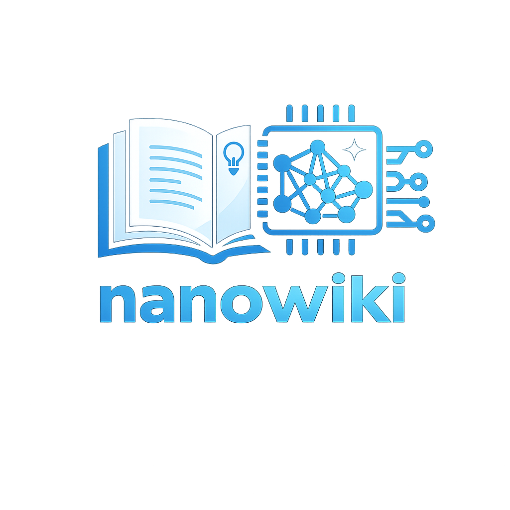

<p align="center">
  
</p>

<h1 align="center">Nanowiki</h1>

<p align="center">
  <b>A lightweight, versatile personal wiki that functions both as a standalone CLI and as a native skill for AI coding agents such as Claude and Gemini.</b>
</p>

---

## Philosophy

Inspired by [Andrej Karpathy's vision for an "llm-wiki"](https://gist.github.com/karpathy/442a6bf555914893e9891c11519de94f):

> You never (or rarely) write the wiki yourself — **the LLM writes and maintains all of it.** You are in charge of sourcing, exploration, and asking the right questions.

We talk to LLMs every day, but those conversations are scattered — across browser tabs, desktop apps, and phones. They fade as time goes by, or stay where they happened and are never recalled. Nanowiki turns them into durable knowledge assets: every question becomes a permanent, linked, searchable note in a local vault you own, available at any time.

- **Obsidian is the IDE.** You read, navigate, and annotate the vault there.
- **The LLM is the programmer.** It writes every note, draws every link, and keeps the indexes fresh.
- **The wiki is the codebase.** Plain Markdown files — local, readable, greppable, and yours forever.

## Architecture

The vault is built from four layers, each with a clear owner:

| Layer      | Owner       | What it holds                                                                   |
| ---------- | ----------- | ------------------------------------------------------------------------------- |
| `sources/` | **You**     | Raw inputs — articles, papers, transcripts, drafts. Immutable.                  |
| `notes/`   | **The LLM** | All wiki pages, flat. Organization is frontmatter + `[[links]]`, never folders. |
| `moc/`     | **The CLI** | Per-domain Maps of Content, auto-regenerated after every change.                |
| `meta/`    | **The CLI** | The full note index, lint reports, and an append-only operation log.            |

### Vault Structure

```
wiki-vault/
├── sources/          ← your raw inputs (immutable)
├── notes/            ← all LLM-generated notes (flat)
├── moc/              ← per-domain Maps of Content (auto-generated)
│   ├── ai.md
│   └── engineering.md
├── meta/
│   ├── index.md      ← full note catalog (auto-generated)
│   ├── lint-<date>.md ← health-check reports
│   └── log.md        ← append-only, grep-friendly operation log
├── wiki-config.json  ← live taxonomy (domains/topics) + overrides
└── WIKI.md           ← the schema document, co-evolved by you and the LLM
```

On first run the vault is scaffolded automatically — directories, a default `wiki-config.json`, and `WIKI.md`. Existing files are never overwritten. Point Obsidian at the vault and everything — `[[links]]`, YAML frontmatter, tags — works out of the box.

### Note Structure

Every note shares one schema: YAML frontmatter for organization, fixed sections for content.

```markdown
---
title: 注意力机制原理与跨领域应用
type: atomic # or literature (for source summaries)
source: # filename/title of the source, for literature notes
domain: ai
topic: attention
tags: [attention, transformer, cross-domain]
created: 2026-06-12
updated: 2026-06-12
---

## Source Facts ← only what sources directly state, as bullets

## Synthesis ← cross-source interpretation (clearly LLM inference)

## Connections ← typed links to existing notes only

## Speculation ← unverified but interesting inferences

## Open Questions ← what this note does not resolve

## Human Insight ← yours alone — the LLM never touches it
```

Two invariants are enforced **in code**, independent of the LLM:

- **Human Insight is sacred.** It is extracted before any rewrite/update and restored verbatim afterward.
- **No dead links.** Connections use typed links (`extends::`, `contradicts::`, `requires::`, `examples::`, `related::`), and any link whose target isn't a real file is stripped.

## Workflows

There are five operations, available in both front ends (CLI: `wiki <cmd>`, skill: `/wiki-<cmd>`):

| Operation            | What it does                                                                           |
| -------------------- | -------------------------------------------------------------------------------------- |
| `ask "<question>"`   | Answer a question well, then format the answer into a new note.                        |
| `query "<question>"` | Answer from the existing notes only, with `[[note]]` citations. Read-only.             |
| `ingest <file\|url>` | Write a literature note for a source, then fan out updates into existing notes.        |
| `rewrite <file>`     | Reformat a draft or rough file into the note schema (Human Insight preserved).         |
| `lint`               | Health-check the vault: consolidate domains, find contradictions, orphans, thin notes. |

### The multi-round `ask` loop

`ask` is two LLM passes wrapped around an interactive refine loop:

- **Pass 1 (answer)** — a near-empty system prompt asks the model to simply answer the question well: free-form, no schema in the way.
- **Pass 2 (format)** — one final call reshapes the answer into the note schema, assigns domain/topic against the existing taxonomy, and links only to notes that already exist.

Between the two passes you stay in the loop as long as you like. Each follow-up revises the free-form answer in place, and nothing is saved until you finish — so the expensive format pass runs exactly once:

```
wiki ask "<question>"
  → pass 1 (answer)
  → render answer to terminal
  → "Any further question? [Y/n]"        (Enter or y/Y = continue; n/N = finish)
      Y → prompt for follow-up ("Rewrite section 2 to mention KV-cache constraints…")
        → refineAnswer() returns the complete updated answer → render → loop
      N → save ONCE:
          final refined answer to sources/<slug>.md — the note's source of record,
          pass 2 (format, with pass-1 candidates) → Source Facts bullets stamped
            ^[<slug>] in code, pointing at that source → note via saveNote
            (collision guard, cleaning, dead-link capture),
          taxonomy, log, MOC/index/WIKI regen
```

The saved pass-1 answer is not just a backup: it is the **source** of the pass-2 note. Every `## Source Facts` bullet is stamped with a `^[<slug>]` citation marker (in code, never by the model) that resolves to that file in `sources/`, the same way `ingest` ties facts to the documents it reads — so `wiki lint`'s citation check covers ask notes too.

The loop then continues across days: each saved note ends with `Open Questions`, which become your next `ask` — a **conversation with your own wiki** where every round deepens and links the graph. You never organize anything; domains, topics, links, MOCs, and the index all maintain themselves.

### Feeding it sources

```powershell
wiki ingest attention-paper.md                 # bare name resolves under <vault>/sources/
wiki ingest attention-paper.pdf                # PDF text is extracted automatically
wiki ingest https://example.com/great-post    # URLs are fetched into sources/ first
```

A single source may update many notes: the LLM extracts a summary plus targeted additions, writes a `literature` note, and integrates each addition into the existing note it belongs to. Updates that target a note which doesn't exist are skipped — never invented.

**Supported source formats:**

| Source       | CLI (`wiki ingest`)                                          | Skill (`/wiki-ingest`)                                              |
| ------------ | ------------------------------------------------------------ | --------------------------------------------------------------------- |
| Markdown/text | read directly                                                 | read directly                                                          |
| PDF           | text extracted via `pdf-parse` (text-based PDFs only)        | read via the agent's Read tool (chunked by page range if >20 pages)   |
| Image         | not supported                                                 | read visually and transcribed by the agent                            |
| Web/YouTube URL | fetched to `sources/` via Jina Reader, then ingested       | fetched and reduced to Markdown by the agent's own fetch tool          |

The skill front end is the LLM doing its own reading, so it covers scanned PDFs and standalone images the CLI's `pdf-parse` path cannot.

### Why one literature note per source?

`ingest` deliberately produces exactly **one** literature note per source — never a batch of new atomic notes. That note is the source's permanent anchor in the vault: every fact extracted from the document lives under its `## Source Facts`, and every existing atomic note that the source touches gets a targeted addition via fan-out. New concepts that don't yet have a home aren't invented as notes on the spot; dead links the LLM tried to draw are stripped and queued in `meta/wanted-notes.md`, which `wiki questions` folds into your worklist for a future `wiki ask` — a human decision, not an automatic one.

The alternative — minting a new atomic note for every distinct concept a source mentions — was considered and rejected. Creating a *good* atomic note requires the same care `ask` takes for a single question: candidate retrieval, domain/topic assignment, and checking for near-duplicates against the existing graph. Doing that N times per ingested document multiplies the risk of fragmentation and duplicate notes by N, with no human in the loop to catch it. One anchor note per source, plus a curated queue for promoting ideas later, keeps vault growth deliberate.

**The information-loss problem.** A single literature note is fine for a blog post, but a 60-page PDF is a different story. The extraction pass (`getExtractionPrompt`) asks the model for one `"summary"` string capturing "the source's key facts, arguments, and insights" — for a long document, that's asking the model to compress potentially hundreds of distinct facts into one paragraph in a single call. Important details inevitably get dropped, and *which* details survive is non-deterministic.

**The fix: chunk the extraction pass, not the note.** Sources longer than `INGEST_CHUNK_CHARS` (48,000 characters, roughly 20 pages of typical text — the same budget `wiki lint` uses to shard the vault into per-domain chunks) are split on paragraph boundaries before pass 1. Each chunk gets its own extraction call, told explicitly "this is part X of Y — extract from this part only." The resulting per-chunk summaries are concatenated and handed to pass 2 as one block of content, which formats them into the *same single* literature note as always — just with a longer, more complete `## Source Facts` section. `updates[]` proposed by different chunks against the same existing note are merged into one addition before fan-out, so a note is never rewritten twice for one ingest.

Two things stay true regardless of size:

- **Short sources are untouched.** Anything under the chunk budget takes the exact single-call path it always has — no behavior change, no extra latency.
- **A longer Source Facts section is a feature, not a problem to solve.** The literature note's job is to be a faithful anchor for the document it represents; for a long document, that honestly means more bullets. The alternative — a short summary that quietly drops facts — is the actual failure mode this avoids.

The trade-off is proportional cost: a 100-page PDF now makes several extraction calls instead of one, the same way `lint` makes one call per chunk of the vault rather than pretending the whole vault fits in one prompt.

### Importing your drafts

```powershell
wiki rewrite rough-notes.md --type literature
```

`<file>` resolves the same way for `rewrite` and `ingest`: a bare filename is looked up under `<vault>/sources/` first, then treated as a literal path.

### How the vault maintains itself

Three mechanisms keep the vault navigable and healthy without you organizing anything:

- **Maps of Content (`moc/`)** — after every mutating command, the CLI regenerates `moc/<domain>.md` (notes grouped by topic), the full catalog `meta/index.md`, and the domains block of `WIKI.md` — all derived purely from frontmatter. These files are owned by the CLI; hand edits are overwritten.
- **Operation log (`meta/log.md`)** — an append-only, grep-friendly record of every operation: notes created and updated, slug collisions deflected, per-target outcomes of ingest fan-outs. When you wonder "what changed and when," the answer is one search away.
- **Lint (`wiki lint`)** — a periodic LLM health-check that consolidates duplicate domains and reports contradictions, orphan notes, thin notes, and missing links to `meta/lint-<date>.md`. Machine-applicable link fixes ship alongside the prose report as proposals; `--fix` applies the safe subset (typed links where both endpoints exist) in code — everything else stays a human decision.

## CLI Installation & Configuration

**1. Clone and install**

```powershell
git clone https://github.com/ievertan00/nanowiki.git
cd nanowiki
npm install
npm link            # exposes the `wiki` command globally
```

**2. Configure `.env`**

```powershell
copy .env.example .env
```

```ini
WIKI_PATH=C:\path\to\your\vault   # required — where the vault lives

# Output language for note content: zh (default, Simplified Chinese) or en.
# Technical terms (AI, LLM, Docker, …) stay English either way.
WIKI_LANG=zh

# Default provider when --provider is omitted (gemini, qwen, deepseek, ollama)
WIKI_PROVIDER=gemini

GEMINI_API_KEY=your-key
GEMINI_MODEL=gemini-2.5-pro

# Optional alternatives
DEEPSEEK_API_KEY=
QWEN_API_KEY=
OLLAMA_BASE_URL=http://localhost:11434/v1
```

Any OpenAI-compatible endpoint works as a provider. Per-command flags override the defaults:

```powershell
wiki ask "What is attention?" --provider deepseek --lang en
wiki rewrite draft.md --type literature
```

**3. Open the vault in Obsidian (recommended) ** — point Obsidian at `WIKI_PATH` and read.

The vault's `wiki-config.json` owns the live domain/topic taxonomy (the LLM grows it as it coins new domains) and can override language and provider settings per vault.

## Skills

The `skills/` folder ships the same five operations as **native agent skills** — `wiki-ask`, `wiki-query`, `wiki-rewrite`, `wiki-ingest`, `wiki-lint` — that run _inside_ a coding agent (Claude Code, Gemini CLI, and similar). The host agent is the generator, so **no provider or API key is needed**; the vault is the directory the agent was launched in.

**Quickest install — no clone needed:**

```powershell
npx skills add ievertan00/nanowiki
```

This auto-detects your installed agents (Claude Code, Gemini CLI, Codex, Cursor, OpenCode, …) and copies the `wiki-*` skills into each one's skills directory. Each skill folder is self-contained, so it installs verbatim with no build step.

**From a clone**, use the bundled installer:

```powershell
npm run skills:install              # copies into every detected agent CLI
npm run skills:install -- --link    # symlink instead — repo edits go live (dev)
npm run skills:install -- --dest <dir>   # install into one explicit directory
```

It targets `~/.claude/skills/` (Claude Code) and `~/.gemini/skills/` (Gemini CLI), which share the same `SKILL.md` format; a CLI is targeted only if its `~/.<cli>` home directory exists.

**Usage mirrors the CLI**, as slash commands in the agent chat:

```
/wiki-ask "What is KV cache?"
/wiki-query "What does my wiki say about attention?"
/wiki-ingest paper.md
/wiki-rewrite rough-notes.md
/wiki-lint
```

## Requirements

- **Node.js ≥ 18** (the CLI is an ES-module project and uses the built-in test runner)
- **An LLM API key** — only for the standalone CLI (Gemini, DeepSeek, Qwen, or a local Ollama). The agent skills need none.
- **Obsidian** (optional but recommended) — any Markdown reader works; the vault is plain files.

## About

Nanowiki is a thin orchestration layer over LLM calls — most of its behavior lives in prompts, not code. It exists to make Karpathy's llm-wiki pattern practical day-to-day: one command (or slash command) per thought, and a vault that organizes itself.

## License

MIT

## Acknowledgement

- [Andrej Karpathy — _llm-wiki.md_](https://gist.github.com/karpathy/442a6bf555914893e9891c11519de94f), the idea file this project instantiates: raw sources + wiki pages + an index + a schema, with the LLM doing all the writing.
